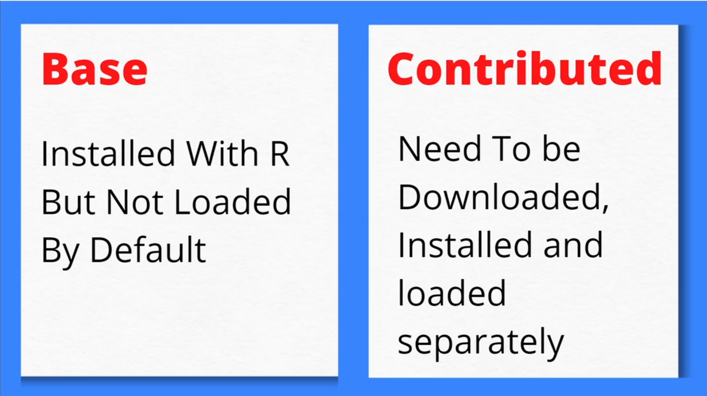

# Machine Learning with R

## Packages in R

**Packages :** 

- Packages are bundles of code that adds new functions to R.

There are two different packages that are:

- **Base packages :** installed with R but not loaded by default.

- **Contributed packages :** need to downloaded, install and loaded separately.
<br><br>



## Sources to get R packages: 
<br>
There are three diffverent places/platform/sources from where we can get these packages are :

1. **CRAN**
2. **CRANTASTIC**
3. **GITHUB**

CRAN is an acronym for **C**omprehensive **R** **A**rchive **N**etwork.

To load all the R packages one library, **Pacman** : Packages Management Tool.

```R
install.packages('pacman')
```
Select current line of code and hit ```CTRL + Enter``` to execute (or) run the aboe line on your R Studio.


